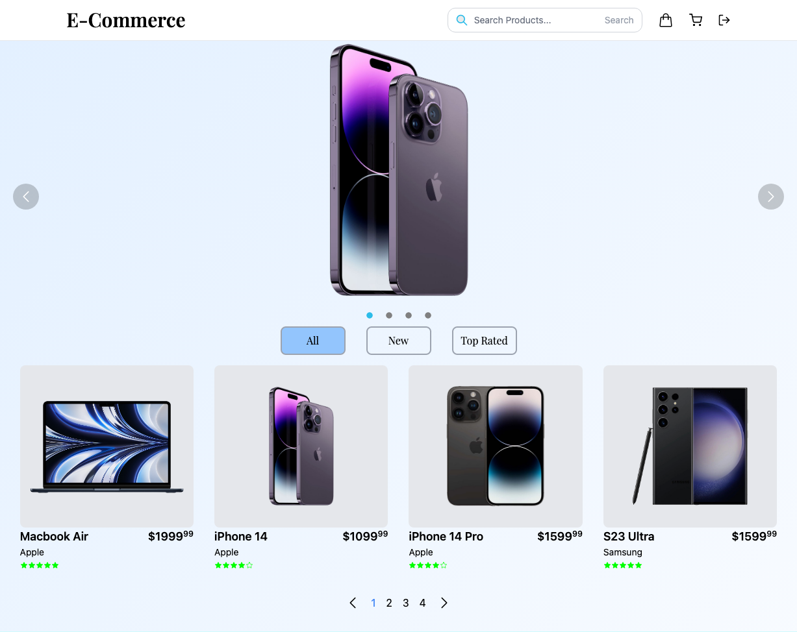

# Tech Trendz React Website

## Introduction

This is a frontend e-commerce website built using React.js. It provides a user-friendly interface for customers to browse and purchase products online. The website includes features such as product listings, product details, shopping cart, user authentication, and order checkout.

## Features

- Browse products: Customers can explore a wide range of products with detailed information and images.
- Product search: Users can search for specific products based on keywords or categories.
- Product filtering: Customers can filter products based on various criteria such as price, brand, or rating.
- Product details: Users can view detailed information about a product, including descriptions, specifications, and customer reviews.
- Shopping cart: Customers can add products to their cart, update quantities, and proceed to checkout.
- User authentication: Users can create an account, log in, and track their orders.
- Order checkout: Customers can review their cart, enter shipping details, and place an order.
- Responsive design: The website is optimized for various screen sizes and devices.

## Technologies Used

- React.js: JavaScript library for building user interfaces
- HTML: Markup language for structuring the website
- CSS: Styling language for designing the website
- JavaScript: Programming language for interactive functionality
- React Router: Library for managing routing within the application

## Screenshots

Include relevant screenshots of the website to showcase its design and features.

## License

This project is licensed under the [MIT License](https://opensource.org/licenses/MIT).

## Contact

If you have any questions or suggestions, please feel free to reach out to us:

- Email: your-email@example.com
- Twitter: [@yourusername](https://twitter.com/yourusername)

We appreciate your feedback!

---

Feel free to customize and expand the readme based on your project's specific requirements. Include any additional sections such as testing, deployment instructions, or acknowledgments.