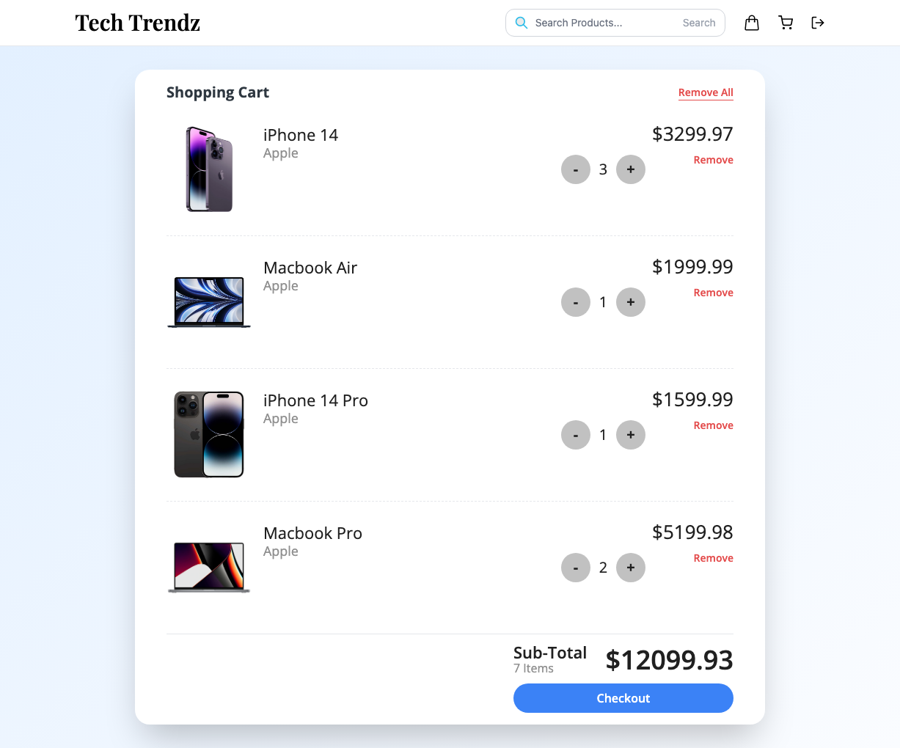
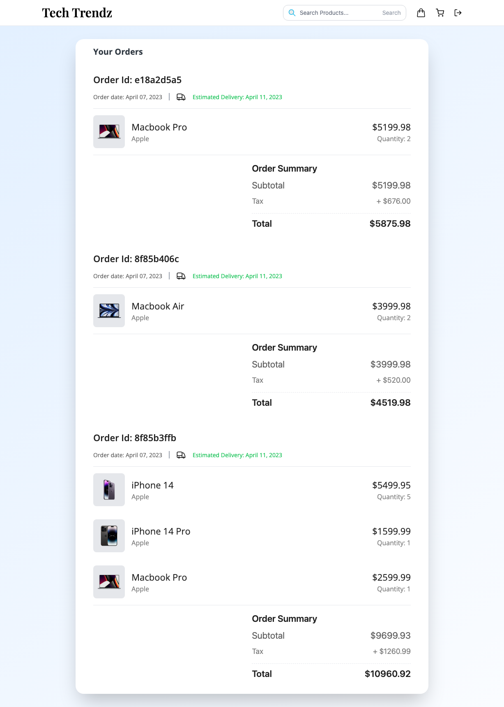

# Tech Trendz React Website

## Introduction

This is a frontend e-commerce website built using React.js. It provides a user-friendly interface for customers to browse and purchase products online. The website includes features such as product listings, product details, shopping cart, user authentication, and order checkout.

## Features

- Browse products: Customers can explore a wide range of products with detailed information and images.
- Product search: Users can search for specific products based on keywords or categories.
- Product filtering: Customers can filter products based on various criteria such as price, brand, or rating.
- Product details: Users can view detailed information about a product, including descriptions, specifications, and customer reviews.
- Shopping cart: Customers can add products to their cart, update quantities, and proceed to checkout.
- User authentication: Users can create an account, log in, and track their orders.
- Order checkout: Customers can review their cart, enter shipping details, and place an order.
- Responsive design: The website is optimized for various screen sizes and devices.

## Technologies Used

- React.js: JavaScript library for building user interfaces
- HTML: Markup language for structuring the website
- CSS: Styling language for designing the website
- JavaScript: Programming language for interactive functionality
- React Router: Library for managing routing within the application

## Installation

1. Navigate to the project directory: `cd frontend`
2. Make sure Node.js is installed on your development machine.
3. Install the required dependencies: `npm install`
4. Set up environment variables for configuration (API endpoints, API keys, etc.).
5. Start the development server: `npm start`
6. Open your web browser and visit: http://localhost:5173 to access the application.

## Screenshots

### Product Page

### Authentication Page

### Cart Page

### Stripe Checkout

### Order Page

  

## License

This project is licensed under the [MIT License](https://opensource.org/licenses/MIT).

## Contributors

- [Keeshigan Pirabaharan](https://github.com/kpirabaharan/Sociopedia.git)

---
